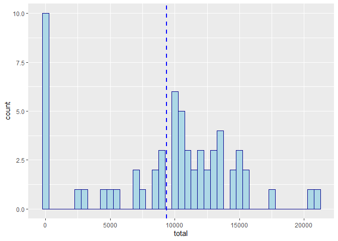

## Loading and preprocessing the data

```r
unzip("activity.zip")
df <- read.csv("activity.csv")
df$date <- as.Date(df$date)
```

## What is mean total number of steps taken per day?

```r
library(ggplot2)
daily_step_df <- data.frame(total=tapply(df$steps, df$date, function(x) {sum(x, na.rm=TRUE)}))
ggplot(daily_step_df, aes(x=total)) +
    geom_histogram(color="darkblue", fill="lightblue", binwidth = 500) +
    geom_vline(aes(xintercept=mean(total)), color="blue", linetype="dashed", size=1)
```

<!-- -->

```r
invisible(dev.copy(png, file = "figure/plot1.png"))
invisible(dev.off())
summary(daily_step_df$total)
```

```
##    Min. 1st Qu.  Median    Mean 3rd Qu.    Max. 
##       0    6778   10395    9354   12811   21194
```
The mean number of steps taken daily over 2 months is 9354 steps.
The median number of steps taken daily over 2 months is 10395 steps.


## What is the average daily activity pattern?

```r
daily_mean_df <- data.frame(x = sort(unique(df$interval)), 
                            avg=tapply(df$steps, df$interval, function(x) {mean(x, na.rm=TRUE)}))
max_step_day <- daily_mean_df[daily_mean_df$avg == max(daily_mean_df$avg), 1]
ggplot(daily_mean_df, aes(x=x, y=avg)) + geom_line() +
    xlab("5 Min Interval") + ylab("average number of steps") +
    geom_vline(xintercept=max_step_day, color="blue", linetype="dashed", size=1)
```

<!-- -->

```r
invisible(dev.copy(png, file = "figure/plot2.png"))
invisible(dev.off())
```
Interval 835 has the highest average steps (206.1698 steps).


## Imputing missing values
Strategy: Mean impute: average of daily steps.

```r
df_impute <- data.frame(df)
sum(is.na(df$steps))
```

```
## [1] 2304
```

```r
for (i in 1:nrow(daily_mean_df)) {
    x = daily_mean_df[i, 1]
    avg = daily_mean_df[i, 2]
    df_impute[(is.na(df_impute$steps)) & (df_impute$interval == x), 1] <- avg
}

daily_step_imputed_df <- data.frame(total=tapply(df_impute$steps, df_impute$date, function(x) {sum(x, na.rm=TRUE)}))
ggplot(daily_step_imputed_df, aes(x=total)) +
    geom_histogram(color="darkblue", fill="lightblue", binwidth = 500) +
    geom_vline(aes(xintercept=mean(total)), color="blue", linetype="dashed", size=1)
```

<!-- -->

```r
invisible(dev.copy(png, file = "figure/plot3.png"))
invisible(dev.off())
summary(daily_step_imputed_df$total)
```

```
##    Min. 1st Qu.  Median    Mean 3rd Qu.    Max. 
##      41    9819   10766   10766   12811   21194
```
There are 2304 missing values in the steps column.
The mean and median number of steps taken daily over 2 months is 10766 steps. This is a different from part 1.  
The result of mean imputing increases both the mean and median (since previously it is zero, now it is > 0).

## Are there differences in activity patterns between weekdays and weekends?

```r
df_impute$day <- ifelse(weekdays(df_impute$date) == "Saturday" | weekdays(df_impute$date) == "Sunday", "weekend", "weekday")
df_impute$day <- as.factor(df_impute$day)

daily_mean_impute_df <- aggregate(steps ~ interval + day, data = df_impute, FUN=mean)

ggplot(daily_mean_impute_df, aes(x=interval, y=steps)) + geom_line() + facet_grid(day ~ .) +
    xlab("5 Min Interval") + ylab("average number of steps")
```

<!-- -->

```r
invisible(dev.copy(png, file = "figure/plot4.png"))
invisible(dev.off())
```

